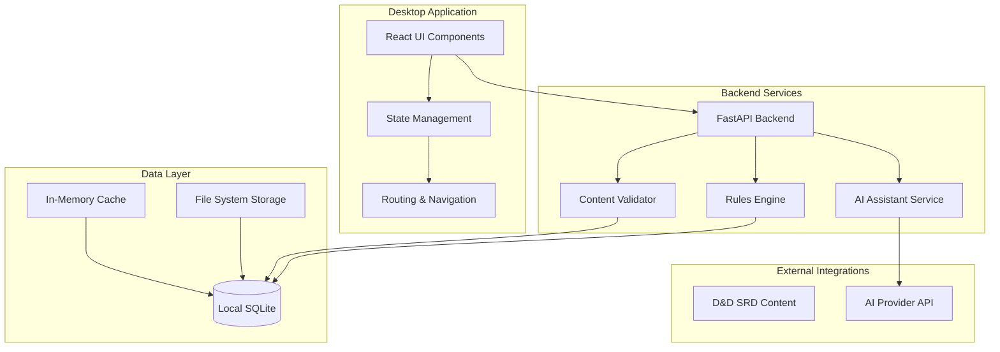
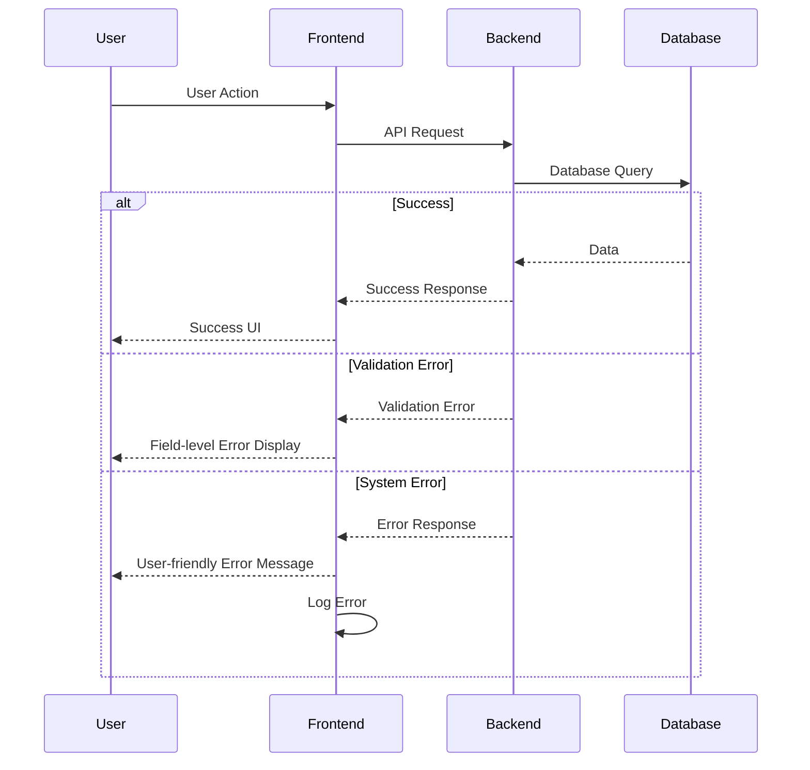

# The Hero Foundry - Fullstack Architecture Document

## Project Overview
**Project Name:** The Hero Foundry - D&D Character Creator  
**Version:** 2.0  
**Date:** 2025-08-19  
**Status:** Architecture Complete  
**Target Platforms:** Desktop & Laptop (Windows/macOS/Linux)  
**Primary Rulebase:** D&D 5e/2024 rules via SRD 5.1/5.2 (licensed content only)  

## Introduction

This document outlines the complete fullstack architecture for The Hero Foundry, a D&D Character Creator application. The architecture combines backend systems, frontend implementation, and their integration to create a unified development approach for AI-driven fullstack development.

The application is designed as a desktop-first, offline-capable character creation platform with AI assistance, homebrew content support, and modular ruleset architecture.

## High Level Architecture

### Technical Summary
The Hero Foundry uses a modern desktop application architecture built with Electron for cross-platform compatibility, React for the frontend interface, and Python FastAPI for backend services. The system employs a file-based storage approach with local-first design, enabling complete offline functionality while maintaining data portability through export/import capabilities.

### Platform and Infrastructure Choice
**Platform:** Desktop Application (Electron-based)  
**Key Services:** Local file system, embedded database, offline-first architecture  
**Deployment Host and Regions:** Local installation, no cloud dependencies  

### Repository Structure
**Structure:** Monorepo with shared packages  
**Monorepo Tool:** npm workspaces  
**Package Organization:** apps (desktop, backend), packages (shared, ui, config)  

### High Level Architecture Diagram



### Architectural Patterns
- **Desktop-First Architecture:** Electron-based cross-platform application
- **Component-Based UI:** React components with TypeScript for type safety
- **Service-Oriented Backend:** FastAPI services with clear separation of concerns
- **File-Based Storage:** Local-first approach with JSON schema validation
- **Modular Ruleset System:** Hot-loadable content with priority-based conflict resolution

## Tech Stack

| Category | Technology | Version | Purpose | Rationale |
|----------|------------|---------|---------|------------|
| **Frontend Language** | TypeScript | 5.0+ | Type-safe development | Prevents runtime errors, improves developer experience |
| **Frontend Framework** | React | 18+ | UI component library | Mature ecosystem, excellent tooling, virtual DOM performance |
| **UI Component Library** | Custom + Radix UI | Latest | Accessible components | Radix provides primitives, custom components for D&D-specific UI |
| **State Management** | Zustand | 4.4+ | Application state | Lightweight, TypeScript-first, simple API |
| **Backend Language** | Python | 3.11+ | Backend services | Project requirement, excellent AI/ML ecosystem |
| **Backend Framework** | FastAPI | 0.109+ | High-performance APIs | Async support, automatic OpenAPI generation, type safety |
| **API Style** | REST + WebSocket | - | Real-time updates | REST for CRUD, WebSocket for AI chat and live validation |
| **Database** | SQLite | 3.45+ | Local data storage | Embedded, no external dependencies, ACID compliance |
| **Cache** | In-Memory | - | Application cache | Fast access, no external dependencies |
| **File Storage** | Local File System | - | Content storage | Offline-first, user control, portable |
| **Authentication** | Local JWT | - | Session management | Offline-capable, secure token storage |
| **Frontend Testing** | Vitest + Testing Library | Latest | Component testing | Fast, React-focused, excellent DX |
| **Backend Testing** | pytest + pytest-asyncio | Latest | API testing | Python standard, async support |
| **E2E Testing** | Playwright | Latest | End-to-end testing | Cross-platform, reliable, fast |
| **Build Tool** | Vite | 5.0+ | Frontend build | Fast HMR, excellent TypeScript support |
| **Bundler** | Vite (built-in) | 5.0+ | Module bundling | Integrated with Vite, optimized for Electron |
| **Desktop Framework** | Electron | 28+ | Cross-platform desktop | Mature, widely adopted, excellent tooling |
| **CI/CD** | GitHub Actions | - | Automated testing | Free tier, excellent integration |
| **Monitoring** | Application Logs | - | Local monitoring | Offline-first approach |
| **Logging** | Structured logging | - | Debug information | JSON format, configurable levels |

## Data Models

### Character Model
**Purpose:** Core character entity with all attributes, abilities, and progression data

**Key Attributes:**
- `id`: UUID - Unique character identifier
- `name`: String - Character name
- `level`: Integer - Current character level
- `race`: Race object - Character race with traits
- `class`: Class object - Character class with features
- `abilities`: AbilityScores object - Strength, Dexterity, Constitution, Intelligence, Wisdom, Charisma
- `proficiencies`: ProficiencySet object - Skills, weapons, armor, languages
- `equipment`: EquipmentSet object - Weapons, armor, items, currency
- `spells`: SpellList object - Known and prepared spells
- `features`: FeatureList object - Racial, class, and background features
- `mode`: String - "balanced" or "free-for-all"
- `version`: Integer - Character version for snapshots

**TypeScript Interface:**
```typescript
interface Character {
  id: string;
  name: string;
  level: number;
  race: Race;
  class: CharacterClass;
  abilities: AbilityScores;
  proficiencies: ProficiencySet;
  equipment: EquipmentSet;
  spells: SpellList;
  features: FeatureList;
  mode: 'balanced' | 'free-for-all';
  version: number;
  createdAt: string;
  updatedAt: string;
  metadata: CharacterMetadata;
}
```

**Relationships:**
- Belongs to a Ruleset
- Has multiple LevelSnapshots
- Contains multiple Features
- Owns Equipment and Spells

### Ruleset Model
**Purpose:** Defines game system rules, content, and validation schemas

**Key Attributes:**
- `id`: String - Ruleset identifier (e.g., "dnd5e")
- `name`: String - Human-readable name
- `version`: String - Ruleset version
- `content`: ContentLibrary object - Races, classes, spells, items
- `schemas`: ValidationSchemas object - JSON schemas for content validation
- `balance`: BalanceRules object - Power budget and balance constraints
- `priority`: Integer - Content conflict resolution priority

**TypeScript Interface:**
```typescript
interface Ruleset {
  id: string;
  name: string;
  version: string;
  content: ContentLibrary;
  schemas: ValidationSchemas;
  balance: BalanceRules;
  priority: number;
  metadata: RulesetMetadata;
}
```

## API Specification

### REST API Specification

```yaml
openapi: 3.0.0
info:
  title: The Hero Foundry API
  version: 2.0.0
  description: API for D&D Character Creator application
servers:
  - url: http://localhost:8000
    description: Local development server
  - url: file:///api
    description: Local file-based API

paths:
  /api/characters:
    get:
      summary: List all characters
      responses:
        '200':
          description: List of characters
          content:
            application/json:
              schema:
                type: array
                items:
                  $ref: '#/components/schemas/Character'
    
    post:
      summary: Create a new character
      requestBody:
        required: true
        content:
          application/json:
            schema:
              $ref: '#/components/schemas/CharacterCreate'
      responses:
        '201':
          description: Character created successfully
          content:
            application/json:
              schema:
                $ref: '#/components/schemas/Character'

  /api/characters/{characterId}:
    get:
      summary: Get character by ID
      parameters:
        - name: characterId
          in: path
          required: true
          schema:
            type: string
      responses:
        '200':
          description: Character details
          content:
            application/json:
              schema:
                $ref: '#/components/schemas/Character'

  /api/rulesets:
    get:
      summary: List available rulesets
      responses:
        '200':
          description: List of rulesets
          content:
            application/json:
              schema:
                type: array
                items:
                  $ref: '#/components/schemas/Ruleset'

  /api/ai/chat:
    post:
      summary: AI assistant chat
      requestBody:
        required: true
        content:
          application/json:
            schema:
              type: object
              properties:
                message:
                  type: string
                context:
                  $ref: '#/components/schemas/CharacterContext'
      responses:
        '200':
          description: AI response
          content:
            application/json:
              schema:
                $ref: '#/components/schemas/AIResponse'

components:
  schemas:
    Character:
      $ref: '#/components/schemas/Character'
    CharacterCreate:
      type: object
      required: [name, race, class]
      properties:
        name:
          type: string
        race:
          type: string
        class:
          type: string
    CharacterContext:
      type: object
      properties:
        characterId:
          type: string
        currentStep:
          type: string
        mode:
          type: string
    AIResponse:
      type: object
      properties:
        message:
          type: string
        actions:
          type: array
          items:
            type: string
        citations:
          type: array
          items:
            type: string
```

## Components

### Frontend Components

**Character Creation Wizard**
- **Responsibility:** Step-by-step character creation flow
- **Key Interfaces:** Step navigation, form validation, progress tracking
- **Dependencies:** Character service, validation service, ruleset service
- **Technology Stack:** React components, Zustand state, form validation

**AI Chat Panel**
- **Responsibility:** Context-aware AI assistance interface
- **Key Interfaces:** Chat interface, AI actions, rule citations
- **Dependencies:** AI service, character context, ruleset service
- **Technology Stack:** React components, WebSocket connection, markdown rendering

**Character Sheet Viewer**
- **Responsibility:** Display and edit character information
- **Key Interfaces:** Character display, editing forms, export options
- **Dependencies:** Character service, export service, validation service
- **Technology Stack:** React components, PDF generation, image rendering

### Backend Components

**Character Service**
- **Responsibility:** Character CRUD operations and business logic
- **Key Interfaces:** Character management, validation, progression tracking
- **Dependencies:** Database service, validation service, ruleset service
- **Technology Stack:** FastAPI, SQLAlchemy, Pydantic models

**Rules Engine**
- **Responsibility:** Game rules processing and content management
- **Key Interfaces:** Ruleset loading, content validation, balance checking
- **Dependencies:** File system service, validation service, cache service
- **Technology Stack:** Python, JSON schema validation, content parsing

**AI Assistant Service**
- **Responsibility:** AI-powered character creation assistance
- **Key Interfaces:** Chat processing, context analysis, rule explanations
- **Dependencies:** AI provider API, character service, ruleset service
- **Technology Stack:** FastAPI, AI provider SDK, context processing

## Unified Project Structure

```
the-hero-foundry/
├── .github/                    # CI/CD workflows
│   └── workflows/
│       ├── ci.yaml
│       └── release.yaml
├── apps/                       # Application packages
│   ├── desktop/                # Electron desktop application
│   │   ├── src/
│   │   │   ├── main/           # Main process
│   │   │   │   ├── index.ts
│   │   │   │   └── preload.ts
│   │   │   ├── renderer/       # Renderer process (React)
│   │   │   │   ├── components/ # UI components
│   │   │   │   ├── pages/      # Page components
│   │   │   │   ├── hooks/      # Custom React hooks
│   │   │   │   ├── services/   # Frontend services
│   │   │   │   ├── stores/     # Zustand stores
│   │   │   │   ├── styles/     # Global styles
│   │   │   │   └── utils/      # Frontend utilities
│   │   │   └── index.html
│   │   ├── public/             # Static assets
│   │   ├── tests/              # Frontend tests
│   │   ├── electron-builder.json
│   │   └── package.json
│   └── backend/                # FastAPI backend
│       ├── src/
│       │   ├── main.py         # FastAPI application
│       │   ├── api/            # API routes
│       │   ├── services/       # Business logic
│       │   ├── models/         # Data models
│       │   ├── schemas/        # Pydantic schemas
│       │   ├── utils/          # Backend utilities
│       │   └── config/         # Configuration
│       ├── tests/              # Backend tests
│       └── requirements.txt
├── packages/                   # Shared packages
│   ├── shared/                 # Shared types and utilities
│   │   ├── src/
│   │   │   ├── types/          # TypeScript interfaces
│   │   │   ├── constants/      # Shared constants
│   │   │   └── utils/          # Shared utilities
│   │   └── package.json
│   ├── ui/                     # Shared UI components
│   │   ├── src/
│   │   │   ├── components/     # Reusable UI components
│   │   │   ├── hooks/          # Shared React hooks
│   │   │   └── styles/         # Shared styles
│   │   └── package.json
│   └── config/                 # Shared configuration
│       ├── eslint/
│       ├── typescript/
│       ├── vite/
│       └── package.json
├── content/                    # Game content and rulesets
│   ├── dnd5e/                 # D&D 5e content
│   ├── homebrew/              # User homebrew content
│   └── schemas/               # JSON validation schemas
├── scripts/                    # Build and utility scripts
├── docs/                       # Documentation
│   ├── prd.md
│   ├── architecture.md
│   └── fullstack-architecture.md
├── .env.example                # Environment template
├── package.json                # Root package.json (workspaces)
├── electron-builder.json       # Electron build configuration
└── README.md
```

## Development Workflow

### Local Development Setup

**Prerequisites:**
```bash
# Install Node.js 18+ and Python 3.11+
node --version
python --version

# Install global dependencies
npm install -g electron-builder
```

**Initial Setup:**
```bash
# Clone and setup
git clone <repository>
cd the-hero-foundry
npm install

# Setup Python environment
cd apps/backend
python -m venv .venv
source .venv/bin/activate  # On Windows: .venv\Scripts\activate
pip install -r requirements.txt
```

**Development Commands:**
```bash
# Start all services
npm run dev

# Start desktop only
npm run dev:desktop

# Start backend only
npm run dev:backend

# Run tests
npm run test
npm run test:desktop
npm run test:backend

# Build for production
npm run build
npm run build:desktop
```

### Environment Configuration

**Required Environment Variables:**
```bash
# Backend (.env)
DATABASE_URL=sqlite:///./hero_foundry.db
AI_PROVIDER_API_KEY=your_api_key_here
LOG_LEVEL=INFO
ENVIRONMENT=development

# Frontend (.env.local)
VITE_API_BASE_URL=http://localhost:8000
VITE_APP_NAME=The Hero Foundry
VITE_APP_VERSION=2.0.0
```

## Deployment Architecture

### Deployment Strategy
**Frontend Deployment:**
- **Platform:** Electron desktop application
- **Build Command:** `npm run build:desktop`
- **Output Directory:** `dist/` folder
- **Distribution:** Electron Builder packages

**Backend Deployment:**
- **Platform:** Embedded in desktop application
- **Build Command:** `pip install -r requirements.txt`
- **Deployment Method:** Bundled with Electron app

### CI/CD Pipeline
```yaml
name: CI/CD Pipeline
on:
  push:
    branches: [main, develop]
  pull_request:
    branches: [main]

jobs:
  test:
    runs-on: ubuntu-latest
    steps:
      - uses: actions/checkout@v4
      - uses: actions/setup-node@v4
        with:
          node-version: '18'
      - uses: actions/setup-python@v4
        with:
          python-version: '3.11'
      - run: npm ci
      - run: npm run test
      - run: npm run test:desktop
      - run: npm run test:backend

  build:
    needs: test
    runs-on: ubuntu-latest
    steps:
      - uses: actions/checkout@v4
      - uses: actions/setup-node@v4
        with:
          node-version: '18'
      - run: npm ci
      - run: npm run build
      - uses: actions/upload-artifact@v4
        with:
          name: desktop-app
          path: dist/
```

## Security and Performance

### Security Requirements
**Frontend Security:**
- CSP Headers: Strict content security policy
- XSS Prevention: Input sanitization and validation
- Secure Storage: Encrypted local storage for sensitive data

**Backend Security:**
- Input Validation: Pydantic schema validation
- Rate Limiting: Per-user request limiting
- CORS Policy: Restricted to localhost only

**Authentication Security:**
- Token Storage: Secure local storage with encryption
- Session Management: JWT with configurable expiration
- Password Policy: N/A (local application)

### Performance Optimization
**Frontend Performance:**
- Bundle Size Target: < 10MB for main bundle
- Loading Strategy: Lazy loading for routes and components
- Caching Strategy: In-memory caching with LRU eviction

**Backend Performance:**
- Response Time Target: < 100ms for API calls
- Database Optimization: Indexed queries, connection pooling
- Caching Strategy: In-memory caching for ruleset content

## Testing Strategy

### Testing Pyramid
```
E2E Tests (Playwright)
/        \
Integration Tests (API + UI)
/            \
Frontend Unit (Vitest)  Backend Unit (pytest)
```

### Test Organization
**Frontend Tests:**
```
apps/desktop/tests/
├── components/          # Component tests
├── hooks/              # Hook tests
├── stores/             # State management tests
└── utils/              # Utility function tests
```

**Backend Tests:**
```
apps/backend/tests/
├── api/                # API endpoint tests
├── services/           # Service layer tests
├── models/             # Model tests
└── utils/              # Utility function tests
```

**E2E Tests:**
```
tests/e2e/
├── character-creation/ # Character creation flows
├── ai-assistant/       # AI chat functionality
└── homebrew-builder/   # Homebrew content creation
```

## Coding Standards

### Critical Fullstack Rules
- **Type Sharing:** Always define types in packages/shared and import from there
- **API Calls:** Never make direct HTTP calls - use the service layer
- **Environment Variables:** Access only through config objects, never process.env directly
- **Error Handling:** All API routes must use the standard error handler
- **State Updates:** Never mutate state directly - use proper state management patterns
- **Content Validation:** All user content must pass JSON schema validation
- **Offline First:** All features must work without internet connection
- **Performance:** Character creation must complete in under 5 minutes

### Naming Conventions

| Element | Frontend | Backend | Example |
|---------|----------|---------|---------|
| Components | PascalCase | - | `CharacterSheet.tsx` |
| Hooks | camelCase with 'use' | - | `useCharacter.ts` |
| API Routes | - | kebab-case | `/api/character-sheet` |
| Database Tables | - | snake_case | `character_sheets` |
| Files | kebab-case | kebab-case | `character-service.ts` |
| Variables | camelCase | snake_case | `characterName` / `character_name` |

## Error Handling Strategy

### Error Flow


### Error Response Format
```typescript
interface ApiError {
  error: {
    code: string;
    message: string;
    details?: Record<string, any>;
    timestamp: string;
    requestId: string;
  };
}
```

## Monitoring and Observability

### Monitoring Stack
- **Frontend Monitoring:** Application logs and error tracking
- **Backend Monitoring:** FastAPI logging and performance metrics
- **Error Tracking:** Local error logging with user reporting
- **Performance Monitoring:** Response time tracking and resource usage

### Key Metrics
**Frontend Metrics:**
- Application startup time
- Component render performance
- Memory usage
- User interaction response time

**Backend Metrics:**
- API response times
- Database query performance
- Memory and CPU usage
- Error rates by endpoint

## Conclusion

This fullstack architecture provides a comprehensive foundation for The Hero Foundry D&D Character Creator application. The architecture emphasizes:

1. **Offline-First Design:** Complete functionality without internet connection
2. **Desktop Application:** Cross-platform compatibility through Electron
3. **Modular Architecture:** Hot-loadable rulesets and extensible content
4. **AI Integration:** Context-aware assistance for character creation
5. **Performance Focus:** Sub-5-minute character creation target
6. **Type Safety:** Full TypeScript coverage across frontend and backend
7. **Local Storage:** User-controlled data with export/import capabilities

The architecture supports the project's core requirements while maintaining flexibility for future enhancements and additional game systems.
